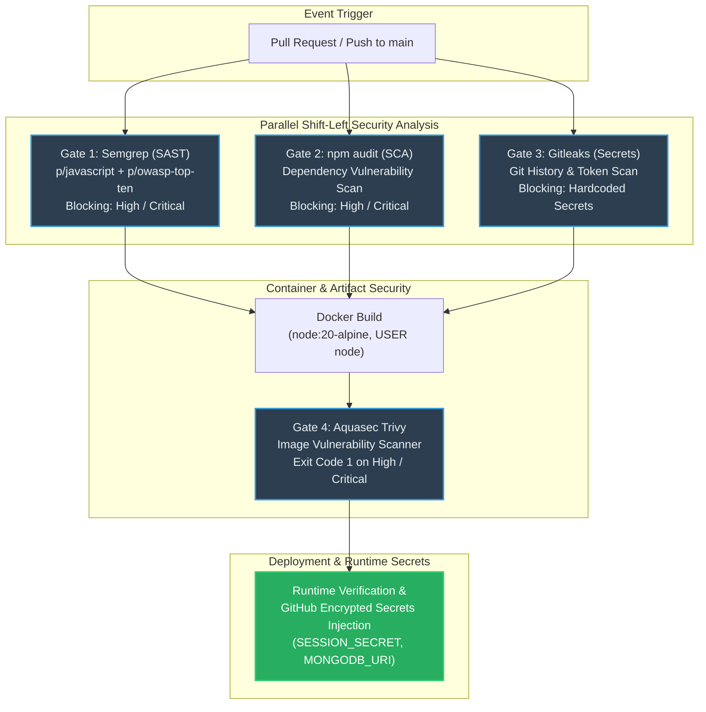

# Automated DevSecOps CI/CD Pipeline Architecture (LO3)

**Project:** SLIIT IE3142 DevSecOps Academic Assessment  
**Author / Responsible Engineer:** Supun Adithya (`hi@supunadithya.com`)  
**Target Codebase:** OWASP NodeGoat  
**Date:** 2026-09-29  
**Pipeline Configuration:** `.github/workflows/devsecops.yml`  

---

## 1. High-Level CI/CD Security Architecture

The automated DevSecOps pipeline enforces a "Shift-Left" security strategy across four distinct automated security gates before authorizing container deployment.

### 1.1 Pipeline Flow Diagram



---

## 2. Detailed Security Gate Specifications

| Gate # | Category | Tool | Scope & Rulesets | Enforcement Policy & Blocking Criteria | Artifact / Output |
| :---: | :--- | :--- | :--- | :--- | :--- |
| **Gate 1** | **SAST** (Static Application Security Testing) | **Semgrep** | Rulesets: `p/javascript`, `p/owasp-top-ten`<br>Target: `app/` | `exit-code: 1` (`--error`) on findings returned by the configured rulesets. | `semgrep-results.sarif` (Uploaded to GitHub Security tab) |
| **Gate 2** | **SCA** (Software Composition Analysis) | **npm audit** | Scans `package.json` and lockfiles for third-party CVEs. | Fails on unaccepted High/Critical advisories; documented unfixable Swig advisories are narrowly allowlisted. | `npm-audit-report.json` |
| **Gate 3** | **Secrets Detection** | **Gitleaks** | Full git commit history (`fetch-depth: 0`) for API tokens, keys, passwords. | Immediate build termination upon detecting any unencrypted secret signature. | Gitleaks Action Summary / Log |
| **Gate 4** | **Container Security** | **Aquasec Trivy** | Scans the built Docker image (`nodegoat-web:${{ github.sha }}`) for OS and library CVEs. | `exit-code: "1"` strictly fails the pipeline on `CRITICAL,HIGH` vulnerabilities. | `trivy-results.sarif` + console table |

---

## 3. Strict Failure Gate & Blocking Enforcement

To satisfy assessment criteria for demonstrable security enforcement:
- **Trivy Image Scan** is configured with `exit-code: 1` on `severity: "CRITICAL,HIGH"`.
- If an insecure base image (e.g. unpatched `node:10` or vulnerable alpine packages) is introduced, Gate 4 terminates the job and blocks deployment.
- **Semgrep SAST** runs with `--error` and halts execution if NoSQL injection, `eval()`, XSS, or insecure deserialization patterns are detected in any pull request.

---

## 4. Reproducing Blocked vs. Passing Pipeline Runs (Evidence Guide)

### 4.1 Demonstrating a Blocked Pipeline Run (Negative Test)
1. Introduce a test security violation into a feature branch:
   ```javascript
   // Add to any route file:
   eval("var test = " + req.query.input);
   ```
2. Open a Pull Request to `main`.
3. **Observed Result:** Gate 1 (Semgrep) detects rule `javascript.express.security.audit.eval-injection`, outputs error exit code 1, and marks the GitHub Actions workflow as **FAILED (Blocked)**.

### 4.2 Demonstrating a Passing Pipeline Run (Positive Test)
1. Merge the remediated code from Phase 3 with type guards, `eval()` removed, contextual escaping, and safe `JSON.parse()`.
2. **Observed Result:**
   - Gate 1 (Semgrep): **0 findings** &rarr; PASS
   - Gate 2 (SCA): Dependencies evaluated &rarr; PASS
   - Gate 3 (Gitleaks): Zero leaked secrets in history &rarr; PASS
   - Gate 4 (Trivy): Hardened non-root `node:20-alpine` image passes &rarr; PASS
   - Deployment stage executes with dynamic secret injection &rarr; **SUCCESS**
