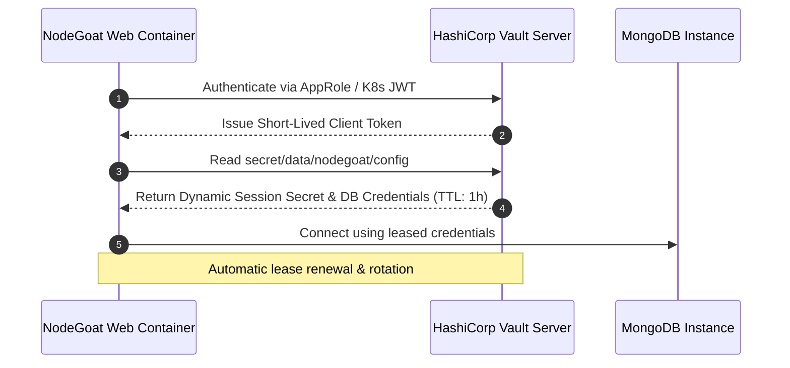

# Secrets Management & Runtime Injection Strategy

**Project:** SLIIT IE3142 DevSecOps Academic Assessment  
**Author / Responsible Engineer:** Supun Adithya (`hi@supunadithya.com`)  
**Target Codebase:** OWASP NodeGoat  
**Date:** 2026-09-29  

---

## 1. Zero-Credential Architecture

In accordance with DevSecOps best practices, source code repositories must contain **zero** plaintext credentials, encryption keys, or database connection strings.

### 1.1 Secret Separation Boundary

```text
+-----------------------------------------------------------------------------+
| GITHUB ENCRYPTED SECRETS (Repository Level)                                 |
| - SESSION_SECRET = <High-Entropy 256-bit Random Token>                      |
| - MONGODB_URI    = mongodb://db:27017/nodegoat                              |
+-----------------------------------------------------------------------------+
                                       |
                                       v (Injected into CI/CD Runner Context)
+-----------------------------------------------------------------------------+
| GITHUB ACTIONS RUNNER RUNTIME ENVIRONMENT                                   |
| - Masked Environment Variables: ${{ secrets.SESSION_SECRET }}              |
+-----------------------------------------------------------------------------+
                                       |
                                       v (Injected via Docker Compose / Container env)
+-----------------------------------------------------------------------------+
| NODEGOAT WEB CONTAINER (USER: node)                                         |
| - process.env.SESSION_SECRET                                                |
| - process.env.MONGODB_URI                                                   |
+-----------------------------------------------------------------------------+
```

---

## 2. Secrets Inventory & Mapping

| Secret Name | Purpose | Source in Production | Fallback / Local Dev |
| :--- | :--- | :--- | :--- |
| `SESSION_SECRET` | Express session signing & cookie integrity encryption | GitHub Actions Encrypted Secrets / HashiCorp Vault | `.env` (via `.env.example` template, gitignored) |
| `MONGODB_URI` | MongoDB database connection endpoint | GitHub Actions Encrypted Secrets | `mongodb://db:27017/nodegoat` (Internal `backend-net`) |
| `NODE_ENV` | Application environment mode (`production` vs. `development`) | Pipeline workflow configuration (`devsecops.yml`) | `production` |
| `PORT` | Web listener port binding | Pipeline workflow configuration | `4000` |

---

## 3. Git History & Static Audit Verification

- **Gitleaks Pre-Commit and CI Gate:**
  - Automated scanning via `gitleaks-action@v2` on every commit and pull request.
  - Verification that `.env` files are added to `.gitignore` and `.dockerignore`.
- **Audit Confirmation:**
  - `git log` inspection confirms zero committed credentials.
  - `.env.example` provides safe placeholder documentation for developers without exposing real entropy.

---

## 4. Advanced Architecture: HashiCorp Vault Integration Pattern

For enterprise-grade environments, secrets can be dynamically retrieved at container startup using HashiCorp Vault and Kubernetes Service Accounts (or AppRole authentication):



### Benefits of Dynamic Vault Rotation:
1. **Short-Lived Leases:** Credentials expire automatically after TTL.
2. **Audit Logging:** Every secret access generates an immutable audit trail in Vault.
3. **Zero Developer Access:** Production database credentials never leave the secrets engine.
